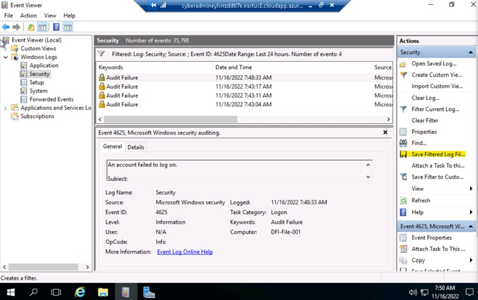

<!-- PROJECT SHIELDS -->
<!--
*** I'm using markdown "reference style" links for readability.
*** Reference links are enclosed in brackets [ ] instead of parentheses ( ).
*** See the bottom of this document for the declaration of the reference variables
*** for contributors-url, forks-url, etc. This is an optional, concise syntax you may use.
*** https://www.markdownguide.org/basic-syntax/#reference-style-links
-->

[![LinkedIn][linkedin-shield]][linkedin-url]

<!-- PROJECT LOGO -->
 

    

  <h3 align="center">Monitoring and Securing the DFI Environment</h3>

<!-- TABLE OF CONTENTS -->

  
Table of Contents

  <ol>
    <li>
      <a href="#about-the-project">About The Project</a>
      <ul>
        <li><a href="#built-with">Built With</a></li>
      </ul>
    </li>
    <li><a href="#usage">Usage</a></li>
    <li><a href="#license">License</a></li>
    <li><a href="#contact">Contact</a></li>
  </ol>

<!-- ABOUT THE PROJECT -->
## About The Project

![cover]

* Project Name: Monitoring and Securing the DFI Environment
* Version: v1.0.0
* Organization Department: Technology

### Description

I performed an analysis of "Windows server 2016" and "Linux (CentOS) server" 
using Defense in Depth principles as well as the concept of Least Privilege and provided 
a report of any recommendations on OS hardening, compliance issues, 
encryption, and network security.

I also recommended mitigation steps from my analysis of firewall reports 
(and new connections) in the form of creating sample firewall rules. 
Similarly, I analyzed threat intelligence and crafted sample IDS signatures. 
I also encrypted several files and folders in preparation for transport to a client.

> This project was a milestone in my journey to study the Introduction 
to Cybersecurity Nanodegree provided by Udacity.

#### Project Overview

Douglas Financials Inc (DFI from here forward) has experienced successful 
growth and, as a result, is ready to add a Security Analyst position. 
Previously Information Security responsibilities fell on our System 
Administration team. Due to compliance and the growth of DFI, 
we are happy to bring you on as our first InfoSec employee! Once you are 
settled in and finished orientation, we have your first 2-Weeks assignments ready.

Week 1: Your first set of tasks is to perform an analysis of 
"Windows server 2016" and "Linux (CentOS) server" using Defense in 
Depth principles as well as the concept of Least Privilege and provide 
a report of any recommendations on OS hardening, compliance issues, 
encryption, and network security.

Week 2: You'll next be asked to recommend mitigation steps from your 
analysis of firewall reports (and new connections) in the form of creating 
sample firewall rules. Similarly, you'll analyze threat intelligence and 
craft sample IDS signatures. You'll also encrypt several files and folders 
in preparation for transport to a client.

(<a href="#readme-top">back to top</a>)

### Built With

This project was developed using the following tech stacks:

* Windows server 2016
* Linux (CentOS) server

(<a href="#readme-top">back to top</a>)

<!-- USAGE EXAMPLES -->
## Usage

### Screensshots

(<a href="#readme-top">back to top</a>)

<!-- LICENSE -->
## License

Distributed under the MIT License. See `LICENSE.txt` for more information.

(<a href="#readme-top">back to top</a>)

<!-- CONTACT -->
## Contact

Mohamed AbdelGawad Ibrahim - [@m-abdelgawad](https://www.linkedin.com/in/m-abdelgawad/) - +201069052620 - muhammadabdelgawwad@gmail.com

Github Profile Link: [https://github.com/m-abdelgawad](https://github.com/m-abdelgawad)

(<a href="#readme-top">back to top</a>)

<!-- MARKDOWN LINKS & IMAGES -->
<!-- https://www.markdownguide.org/basic-syntax/#reference-style-links -->
[linkedin-shield]: https://img.shields.io/badge/-LinkedIn-black.svg?style=for-the-badge&logo=linkedin&colorB=555
[linkedin-url]: https://www.linkedin.com/in/m-abdelgawad/
[cover]: images/cover.jpg
